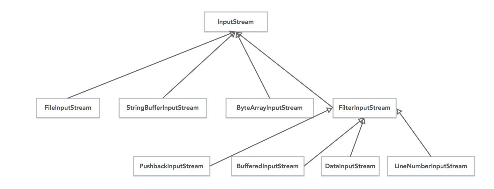

# 设计模式

## 策略模式

### 基础
- 抽象
- 封装
- 继承
- 多态

### 设计原则
1. 找出应用中可能需要变化之处，把它们独立出来，不要和那些不需要变化的代码混在一起
2. 针对接口编程，而不是针对实现编程
3. 多用组合，少用继承

### 策略模式（Strategy Pattern)
策略模式定义了算法族，分别封装起来，让它们之间可以互相替换，此模式让算法的变化独立于使用算法的客户。

## 观察者模式（Observer Pattern）

出版者 + 订阅者 = 观察者模式
subject + Observer

观察者模式定义了一系列对象之间的一对多关系，当一个对象改变状态，其他依赖者都会收到通知。

push/pull

### 设计原则
1. 交互对象之间松耦合设计

java.util 包内包含最基本的 Observer 接口与 Observable 类，可自由使用 push / pull

问题
1. 不要依赖于观察者被通知的次序
2. Observable 是一个类，如果某个类想同时具有 Observable 类和另一个超类的行为，会存在多继承问题，限制了 Observable 的复用潜力
3. 没有 Observable 接口，所以无法建立自己的实现，和 Java 内置的 Observer API 搭配使用
4. Observable 将关键方法 protected ，意味着除非继承，否则无法创建 Observable 实例并组合到自己的对象中来

JavaBeans 和 Swing 也实现了观察者模式

## 装饰者模式

装饰者模式：动态地将责任附加到对象上，若要扩展功能，装饰者提供了比继承更有弹性的替代方案

1. 装饰者和被装饰对象有相同的超类型
2. 可以用一个或多个装饰者包装一个对象
3. 装饰者可以在所委托被装饰者的行为之前与/或之后，加上自己的行为，以达到特定的目的

LineNumberInputStream => BufferedInputStream => FileInputStream

LineNumberInputStream / BufferedInputStream 都扩展自 FileInputStream
而 FileInputStream 是一个抽象的装饰类

## 工厂模式
找出会变化的部分，把它们从不变的部分中抽离出来
工厂方法模式：定义了一个创建对象的接口，但由子类决定要实例化的类是哪一个。工厂方法让类把实例化推迟到子类。

`abstract Product factoryMethod(String type)`

简单工厂把全部事情在一个地方处理完，工厂方法创建一个框架，让子类决定如何实现。

抽象工厂模式提供一个接口用于创建相关或依赖对象的家族，而不需要明确指定具体类

## 单例模式
单例模式：确保一个类只有一个实例，并提供一个全局访问点